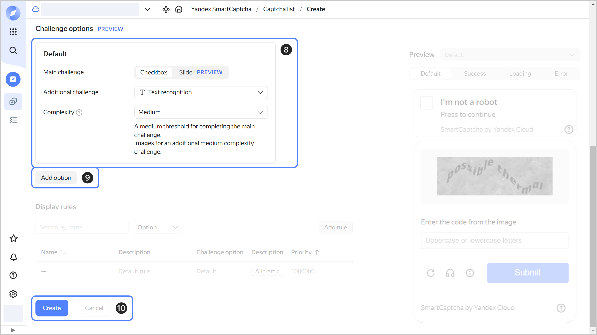
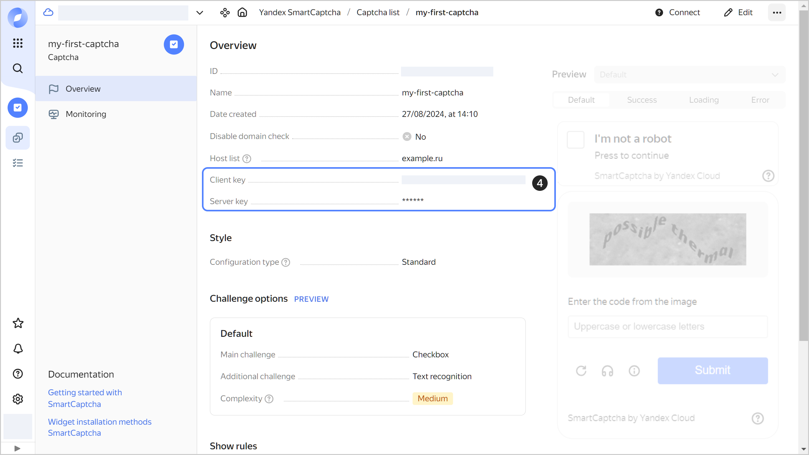

# Getting started with {{ captcha-full-name }}

To get started with the service:

1. [Create a CAPTCHA](#creat-captcha).
1. [Get keys](#get-keys).
1. [Add the widget to the page](#add-widget).
1. [Check the user response](#check-answer).


## Getting started {#before-begin}

1. Go to the [management console]({{ link-console-main }}). Log in to {{ yandex-cloud }} or register if you do not have an account yet.
1. On the [**{{ ui-key.yacloud_billing.billing.label_service }}**]({{ link-console-billing }}) page, make sure you have a [billing account](../billing/concepts/billing-account.md) linked and it has the `ACTIVE` or `TRIAL_ACTIVE` status. If you do not have a billing account, [create one](../billing/quickstart/index.md).


## Create a CAPTCHA {#creat-captcha}



- Management console {#console}

    1. In the [management console]({{ link-console-main }}), select the folder.
    1. Select **{{ ui-key.yacloud.iam.folder.dashboard.label_smartcaptcha }}**.
    1. Click **{{ ui-key.yacloud.smartcaptcha.button_captcha-settings-create }}**.

       

    1. Enter a CAPTCHA name. The naming requirements are as follows:

        

    1. (Optional) Disable [domain name validation](./concepts/domain-validation.md).
    1. Specify a list of sites where the CAPTCHA will be placed.
    1. Leave the **{{ ui-key.yacloud.smartcaptcha.label_section-style }}** as is.

       

    1. Set up a default CAPTCHA:
       1. Select the [main challenge](./concepts/tasks.md#main-task) type.
       1. Select the [additional challenge](./concepts/tasks.md#additional-task) type.
       1. Select the `{{ ui-key.yacloud.smartcaptcha.value_complexity-medium }}` [level](./concepts/tasks.md#task-difficulty).

    1. You can add [challenge options](concepts/captcha-variants.md) and configure incoming traffic rules to display different CAPTCHAs to different users. In this example, you will configure a single default CAPTCHA for all users.
    1. Click **{{ ui-key.yacloud.common.create }}**.

       




## Retrieve the CAPTCHA keys {#get-keys}



- Management console {#console}

    1. In the [management console]({{ link-console-main }}), select the folder.
    1. Select **{{ ui-key.yacloud.iam.folder.dashboard.label_smartcaptcha }}**.
    1. Click the name of the CAPTCHA or [create](#creat-captcha) a new one.
    1. In the **{{ ui-key.yacloud.common.overview }}** tab, copy the **{{ ui-key.yacloud.smartcaptcha.label_client-key }}** and **{{ ui-key.yacloud.smartcaptcha.label_server-key }}** field values.

    



With the client key, you can [add a {{ captcha-name }} widget](#add-widget) to your page. You will need the server key to [check the user response](#check-answer).


## Add the widget to the page {#add-widget}

Add the widget automatically:

1. Add the JS script to the user page. To do this, place the following code anywhere on the page, e.g., inside the `<head>` tag:

    ```html
    <script src="https://smartcaptcha.yandexcloud.net/captcha.js" defer></script>
    ```

    The `captcha.js` script will automatically find all `div` elements with the `smart-captcha` class and install the widget in them.

1. Add an empty container (a `div` element) to the page so that the `captcha.js` script loads the widget to it:

    ```html
    <div
        id="captcha-container"
        class="smart-captcha"
        data-sitekey="<client_key>"
    ></div>
    ```

    

The **I’m not a robot** button will appear on the page. The service will check the user request after the user clicks the button. If the request seems suspicious, the service will ask the user to perform an action.


## Check the user response {#check-answer}

After the check, the user is given a unique token. The token is loaded to the `<input type="hidden" name="smart-token" value="<token>"` element inside the widget container. For example:

```html
<div id="captcha-container" class="smart-captcha" ...>
    <input type="hidden" name="smart-token" value="<token>">
    ...
</div>
```

To validate the token, send a GET request to `https://smartcaptcha.yandexcloud.net/validate` with the following parameters:



In its response, the service will return a JSON object containing the `status` and `message` fields. If the `status` field value is `ok`, the `host` field is added to the JSON object. It shows on what website the validation was passed. For response examples, see [User validation](concepts/validation.md#service-response).


Example of the token validation function:



- Node.js {#node}

    ```js
    const https = require('https'),
        querystring = require('querystring');

    const SMARTCAPTCHA_SERVER_KEY = "<server_key>";


    function check_captcha(token, callback) {
        const options = {
            hostname: 'smartcaptcha.yandexcloud.net',
            port: 443,
            path: '/validate?' + querystring.stringify({
                secret: SMARTCAPTCHA_SERVER_KEY,
                token: token,
                ip: '<user_IP_address>', // Method for retrieving the user IP address depends on your framework and proxy.
            }),
            method: 'GET',
        };
        const req = https.request(options, (res) => {
            res.on('data', (content) => {
                if (res.statusCode !== 200) {
                    console.error(`Allow access due to an error: code=${res.statusCode}; message=${content}`);
                    callback(true);
                    return;
                }
                callback(JSON.parse(content).status === 'ok');
            });
        });
        req.on('error', (error) => {
            console.error(error);
            callback(true);
        });
        req.end();
    }


    let token = "<token>";
    check_captcha(token, (passed) => {
        if (passed) {
            console.log("Passed");
        } else {
            console.log("Robot");
        }
    });
    ```

- PHP {#php}

    ```php
    define('SMARTCAPTCHA_SERVER_KEY', '<server_key>');

    function check_captcha($token) {
        $ch = curl_init();
        $args = http_build_query([
            "secret" => SMARTCAPTCHA_SERVER_KEY,
            "token" => $token,
            "ip" => $_SERVER['REMOTE_ADDR'], // You need to provide the user IP address.
                                             // Method for retrieving the user IP depends on your proxy.
        ]);
        curl_setopt($ch, CURLOPT_URL, "https://smartcaptcha.yandexcloud.net/validate?$args");
        curl_setopt($ch, CURLOPT_RETURNTRANSFER, true);
        curl_setopt($ch, CURLOPT_TIMEOUT, 1);

        $server_output = curl_exec($ch);
        $httpcode = curl_getinfo($ch, CURLINFO_HTTP_CODE);
        curl_close($ch);

        if ($httpcode !== 200) {
            echo "Allow access due to an error: code=$httpcode; message=$server_output\n";
            return true;
        }
        $resp = json_decode($server_output);
        return $resp->status === "ok";
    }

    $token = $_POST['smart-token'];
    if (check_captcha($token)) {
        echo "Passed\n";
    } else {
        echo "Robot\n";
    }
    ```

- Python {#python}

    ```py
    import requests
    import sys
    import json


    SMARTCAPTCHA_SERVER_KEY = "<server_key>"


    def check_captcha(token):
        resp = requests.get(
            "https://smartcaptcha.yandexcloud.net/validate",
            {
                "secret": SMARTCAPTCHA_SERVER_KEY,
                "token": token,
                "ip": "<user_IP_address>"  # Method for retrieving the IP address depends on your framework and proxy.                                   
                                                 # In Flask, for example, this can be `request.remote_addr`
            },
            timeout=1
        )
        server_output = resp.content.decode()
        if resp.status_code != 200:
            print(f"Allow access due to an error: code={resp.status_code}; message={server_output}", file=sys.stderr)
            return True
        return json.loads(server_output)["status"] == "ok"
    token = "<token>"  # For example, `request.form["smart-token"]`
    if check_captcha(token):
        print("Passed")
    else:
        print("Robot")
    ```




## What's next {#whats-next}

* Read more [about connection methods](./concepts/widget-methods.md) for the {{ captcha-name }} widget.